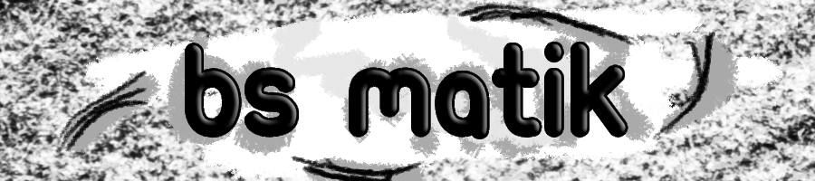

# BsMatik
BsMatik is a calculation application. You can easily perform addition, subtraction, multiplication and division operations  from this application.

## How to Use BsMatik:  
When you enter the application,  below are the operations of add, subtract, multiply and divide.  Choose one according to the calculation you will make,  then enter your numbers in the textboxes, when you press the equalize button,  it will give you the result.

## Installation
You can download the latest version of BsMatik for Windows from the link below. For installation, simply double-click the exe file and start it without taking any action.
### [`Download the Latest Version`](https://github.com/FVuar/BsMatik/releases/latest)

## Errors that may occur in the application:  

- Please do not enter a string value.  
- Do not copy-paste string value into text box.  
- Special Character : .,*/- etc. Do not use.

    
Turkish

    

        <h1> BsMatik </h1>
        BsMatik, hesap makinesi uygulamasıdır.
        <h2>Nedir bu BsMatik?</h2>  
        BsMatik bir hesap makinesi uygulamasıdır.  Toplama, çıkarma, çarpma ve bölme işlemlerini bu uygulamadan kolaylıkla gerçekleştirebilirsiniz.
        <h2>BsMatik Nasıl Kullanılır?</h2> 
        Uygulamaya girdiğinizde aşağıda toplama, çıkarma, çarpma ve bölme işlemleri yer almaktadır.  Yapacağınız hesaplamaya göre birini seçin, ardından ilgili girdi alanlarına sayılarınızı girin, eşitle butonuna bastığınızda size verdiğiniz işlemin sonucunu döndürecektir.
        <h2>Nasıl İndirilir ve Kurululur</h2>
        BsMatik'in Windows için son sürümünü aşağıdaki bağlantıdan indirebilirsiniz. Kurulum için exe dosyasına çift tıklayıp başlatmanız yeterlidir.
        <h3><a href="https://github.com/FVuar/BsMatik/releases/latest"><code>En Son Sürümü İndirmek için Tıklayınız</code></a></h3>
        <h2>Uygulamada oluşabilecek hatalar!</h2>
        <ul>
            <li>Lütfen metinsel bir değer girmekten kaçının.</li>
            <li>Girdi alanlarına kopyala-yapıştır işlevi uygulamayınız.</li> 
            <li>Lütfen özel karakterler(.,*/- vb.) kullanmayınız.</li>   
        </ul>
    
  

